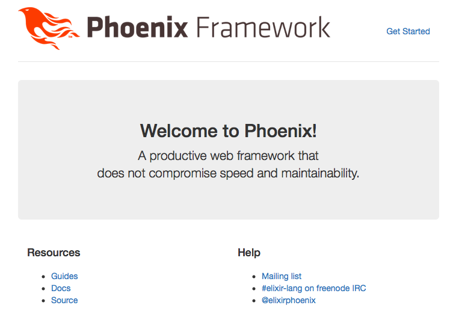

# Elixir-and-Phoenix
Elixir and Phoenix applications based on a great Udemy class taught by Stephen Grider.

Concepts learned:
1) An Elixir Warmup
2) Elixir's Amazing Pattern Matching
3) Testing and Documentation
4) A Few Side Topics
5) Image Manipulation with Elixir
6) Structs - Elixir's Data Modeling Tool
7) On to Phoenix
8) MVC in Phoenix
9) Models in Phoenix
10) Working with Postgres
11) Handling Authentication with OAuth
12) Transforming Requests with Plugs
13) Websockets in Phoenix

References:  
https://elixir-lang.org  
http://www.phoenixframework.org  
https://github.com/StephenGrider/ElixirCode  
https://www.udemy.com/the-complete-elixir-and-phoenix-bootcamp-and-tutorial  
https://github.com/doomspork/elixir-companies
https://quiet-lake-82310.herokuapp.com

